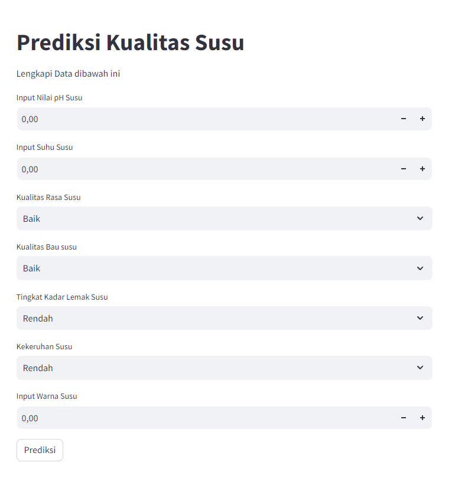

# Laporan Proyek Machine Learning

### Nama : Hadi Sahrul Fauzi
### Nim : 211351060
### Kelas : Malam A

## Domain Proyek

Prediksi kualitas susu merupakan salah satu aplikasi yang dapat memberikan manfaat bagi industri pengolahan susu. Dengan adanya aplikasi ini, produsen dapat mengetahui kualitas susu sebelum diolah sehingga dapat mengambil tindakan yang tepat untuk meningkatkan kualitas susu.

## Business Understanding

Dalam langkah pertama, kita akan fokus pada pemahaman aplikasi yang bertujuan untuk memprediksi kualitas susu. Tahap ini akan membantu kita mengidentifikasi, merinci, dan memahami secara lebih mendalam masalah yang perlu diatasi oleh aplikasi tersebut.

### Problem Statements
Berikut adalah beberapa masalah yang dapat diatasi dengan aplikasi prediksi kualitas susu: 

- Kesulitan dalam mengidentifikasi faktor-faktor yang mempengaruhi kualitas susu, yang dapat mengarah pada manajemen kualitas yang tidak tepat.
- Kurangnya dukungan dalam mengarahkan produsen pada tindakan perbaikan yang sesuai, seperti peningkatan kualitas bahan baku, proses pengolahan, atau penyimpanan.
- Keterlambatan dalam deteksi kualitas susu yang rendah, yang berpotensi mengakibatkan penurunan kualitas produk susu.

### Goals

Berikut adalah beberapa tujuan dari aplikasi prediksi kualitas susu:

- Meningkatkan identifikasi faktor-faktor yang mempengaruhi kualitas susu untuk pengelolaan kualitas yang lebih tepat.
- Memberikan rekomendasi yang lebih tepat dalam perbaikan kualitas susu, termasuk peningkatan kualitas bahan baku, proses pengolahan, atau penyimpanan.
- Meningkatkan deteksi kualitas susu yang rendah sehingga dapat meningkatkan kualitas produk susu yang baik.

### Solution statements
- Melakukan analisis data yang mendalam untuk mengidentifikasi pola dan tren yang berkaitan dengan kualitas susu. Ini dapat mencakup analisis statistik dan penggunaan teknik seperti data mining.
- Aplikasi prediksi kualitas susu akan memanfaatkan data susu yang relevan, termasuk faktor-faktor yang mempengaruhi kualitas susu, seperti kualitas bahan baku, proses pengolahan, dan penyimpanan. Data ini akan digunakan untuk melatih model machine learning yang dapat memprediksi kualitas susu.
- Model yang dihasilkan dari datasets itu menggunakan metode Random Forest Classifier.

## Data Understanding
Dataset ini dikumpulkan secara manual dari observasi. Hal ini membantu kami membuat model pembelajaran mesin untuk memprediksi kualitas susu.
Dataset ini terdiri dari 8 variabel independen yaitu pH, Suhu, Rasa, Bau, Lemak, Kekeruhan, Warna dan Kualitas. Umumnya, Kualitas atau Kualitas susu bergantung pada parameter-parameter ini. Parameter ini memainkan peran penting dalam analisis prediktif susu. Dataset susu berisi 429 contoh kualitas buruk, 374 contoh kualitas menengah, dan 256 contoh kualitas baik.

[Milk Quality Prediction] (https://www.kaggle.com/datasets/cpluzshrijayan/milkquality).


### Variabel-variabel pada Milk Quality Prediction Dataset adalah sebagai berikut:
- **pH**            : Fitur ini menentukan pH susu, yang berada pada kisaran 3 hingga 9,5. [float64] 
- **temperature**   : Fitur ini menentukan suhu susu, dan kisarannya adalah dari 34'C hingga 90'C.[int64] 
- **taste**         : Fitur ini mendefinisikan rasa susu dan mengambil nilai yang mungkin: 1 (baik) atau 0 (buruk).[int64] 
- **odor**          : Fitur ini mendefinisikan bau susu dan mengambil nilai yang mungkin: 1 (baik) atau 0 (buruk).[int64] 
- **fat**           : Fitur ini mendefinisikan kandungan lemak susu dan mengambil nilai yang mungkin: 1 (Tinggi) atau 0 (Rendah).[int64] 
- **turbidity**     : Fitur ini menentukan kekeruhan susu dan mengambil nilai yang mungkin: 1 (Tinggi) atau 0 (Rendah).[int64] 
- **colour**        : Fitur ini menentukan warna susu, yang berkisar antara 240 hingga 255.[int64] 
- **grade**         : Ini adalah target dan mengambil nilai: kualitas_rendah, kualitas_sedang, atau kualitas_tinggi.[object] 


## Data Preparation
Pada tahap ini, saya menggunakan metode EDA untuk melakukan preparasi data.
### Data Collection
Untuk data collection ini, saya mendapatkan dataset dari website kaggle dengan nama dataset [Milk Quality Prediction](https://www.kaggle.com/datasets/cpluzshrijayan/milkquality). jika anda tertarik dengan datasetnya, anda bisa click link tersebut.

### Data Discovery And Profiling
Karena kita menggunakan google colab untuk mengerjakannya maka kita akan import files,
``` bash
from google.colab import files
```

Lalu mengupload token kaggle agar nanti bisa mendownload sebuah dataset dari kaggle melalui google colab,
``` bash
file.upload()
```

Setelah mengupload filenya, maka kita akan lanjut dengan membuat sebuah folder untuk menyimpan file kaggle.json yang sudah diupload tadi,
``` bash
!mkdir -p ~/.kaggle
!cp kaggle.json ~/.kaggle/
!chmod 600 ~/.kaggle/kaggle.json
!ls ~/.kaggle
```
Lalu mari kita download datasetsnya,
``` bash
!kaggle datasets download -d cpluzshrijayan/milkquality
```
Selanjutnya kita harus extract file yang tadi telah didownload,
``` bash
!mkdir milkquality
!unzip milkquality.zip -d milkquality
!ls milkquality
```
Kita mengimport semua library yang dibutuhkan, 
``` bash
import pandas as pd
import numpy as np
import seaborn as sns
import matplotlib.pyplot as plt
from sklearn.model_selection import train_test_split
from sklearn.ensemble import RandomForestClassifier
from sklearn.metrics import r2_score,confusion_matrix
```
Lanjut dengan memasukkan file csv yang telah diextract pada sebuah variable
```bash
data = pd.read_csv('milkquality/milknew.csv')
```
Lalu melihat 5 data paling atas dari datasetsnya,
```bash
data.head(5)
```
Untuk melihat statistik deskriptif dari sebuah DataFrame atau struktur data,
``` bash
data.describe()
```
Kemudian saya akan melihat tipe data yang ada pada masing-masing kolom pada dataset tersebut dengan perintah,
``` bash
data.info()
```
Memeriksa nilai yang hilang (NA, Not Available) 
``` bash
data.isna().sum()
```
Memeriksa grup data berdasarkan 'Kelas'
``` bash
data.groupby('Grade').size()
```
Mengubah nilai data 'Grade'
- 0 Untuk "low" #buruk
- 1 Untuk "medium" #sedang
- 2 Untuk "high" #baik
``` bash
data['Grade']=data['Grade'].map({'low':0,'medium':1,'high':2})
data.head()
```
Buat Korelasi heatmap
``` bash
sns.heatmap(data.corr(), annot=True, cmap='coolwarm')
```
 <br>

Kita lihat jumlah data kualitas susu berdasarkan ph nya
``` bash
sns.countplot(x=data['pH'],hue=data['Grade'], palette = "tab10")
```
 <br>

Kita lihat jumlah data kualitas susu berdasarkan Temprature nya
``` bash
sns.countplot(x=data['Temprature'],hue=data['Grade'], palette = "tab10")
```
 <br>

Kita lihat jumlah data kualitas susu berdasarkan Odor nya
``` bash
sns.countplot(x=data['Odor'],hue=data['Grade'], palette = "tab10")
```
 <br>

Kita lihat jumlah data kualitas susu berdasarkan Turbidity nya
``` bash
sns.countplot(x=data['Turbidity'],hue=data['Grade'], palette = "tab10")
```
 <br>

Kita lihat jumlah data kualitas susu berdasarkan Colour nya
``` bash
sns.countplot(x=data['Colour'],hue=data['Grade'], palette = "tab10")
```
 <br>

Lalu lakukan pemisahan data menjadi variabel dependen (target) dan variabel independen (fitur) yang umum dalam pemodelan data. Dalam hal ini, y akan menjadi target atau label, dan x akan menjadi fitur atau atribut yang digunakan untuk memprediksi target,
``` bash
X=data.drop(['Grade'],axis=1)
y=data['Grade']
```
## Modeling

kita membuat objek model Regresi Logistik (Logistic Regression) dalam library scikit-learn (sklearn) dengan beberapa parameter yang telah diatur.
``` bash
from sklearn import linear_model
lr= linear_model.LogisticRegression(random_state = 42,max_iter= 100)
```

Selanjutnya kita akan menentukan berapa persen dari datasets yang akan digunakan untuk test dan untuk train, disini kita gunakan 80% untuk test dan sisanya untuk training alias 20%,
``` bash
X_train,X_test,y_train,y_test=train_test_split(X,y,test_size=0.8,random_state=42)
```

membuat, melatih, dan mengukur akurasi model menggunakan Random Forest Classifier (RFC) dalam scikit-learn,
``` bash
rf = RandomForestClassifier(n_estimators=100, random_state=42)
rf.fit(X_train, y_train)
rf_preds = rf.predict(X_test)
```

Mengukur akurasi model Random Forest Classifier (RFC) pada seluruh dataset,
``` bash
rf.score(X_test, y_test)
```
Ternyata mendapatkan score output 0.9952830188679245 99%

Saya akan coba lakukan pengetesan menggunakan data dumy seperti dibawah ini
``` bash
input_data_milk = np.array([[6.6,	35,	1, 0,	1, 0, 254]])


rf_preds=rf.predict(input_data_milk)
print('Prediksi Kualitas susu:', rf_preds)
```
Setelah pengetesan berhasil, dan modelnya sudah selesai dibuat, kita akan export sebagai sav agar nanti bisa kita gunakan pada project web streamlit kita.
``` bash
import pickle

filename = "milk.sav"
pickle.dump(rf,open(filename,'wb'))
```

## Evaluation
Matrik evaluasi yang saya gunakan disini adalah confusion matrix, karena sangat cocok untuk kasus pengkategorian seperti kasus ini. Dengan membandingkan nilai aktual dengan nilai prediksi.
``` bash
from sklearn.metrics import classification_report, roc_auc_score, accuracy_score, roc_curve, auc
rf_preds = lr.fit(X_train, y_train).predict(X_test)
cm = confusion_matrix(y_test,rf_preds)

print(classification_report(y_test, rf_preds))
print('Accuracy Score: ',accuracy_score(y_test, rf_preds))

plt.figure(figsize = (8, 5))
sns.heatmap(cm, cmap = 'Reds', annot = True, fmt = 'd', linewidths = 5, cbar = False, annot_kws = {'fontsize': 15},
            yticklabels = ['low','medium','high'], xticklabels = ['Predicted low', 'Predicted medium', 'Predicted high'])
plt.yticks(rotation = 0)
plt.show()

```
 <br>


## Deployment

[My Milk Quality Prediction App](https://prediksi-kualitas-susu-byhadi.streamlit.app/).




